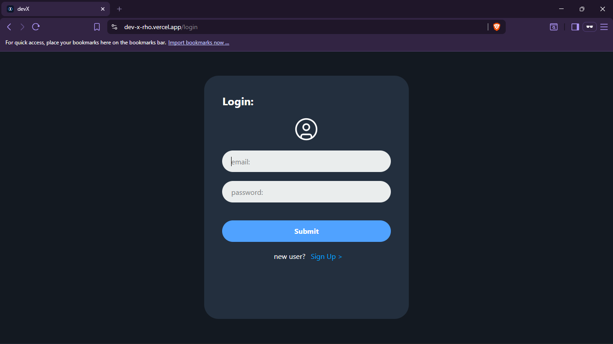
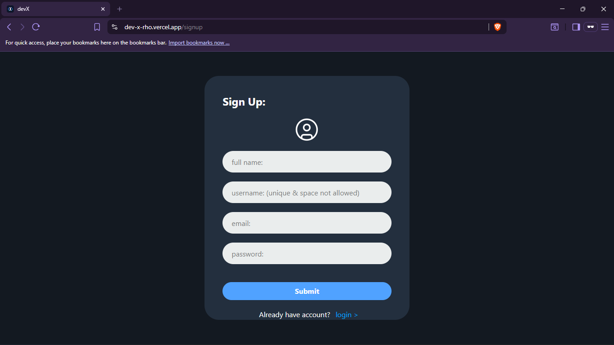
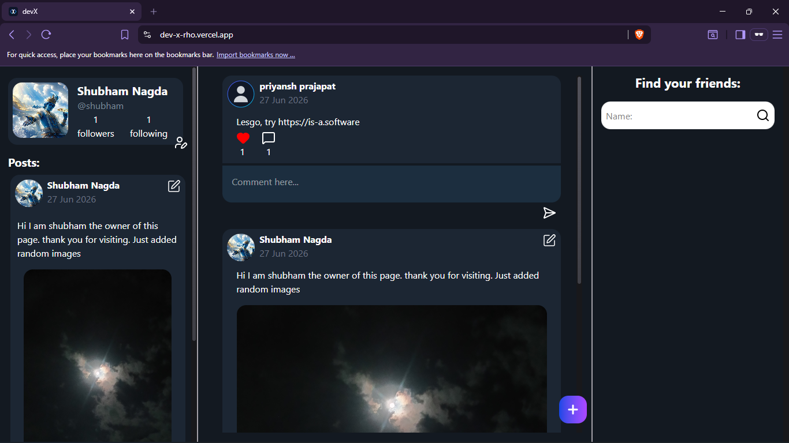
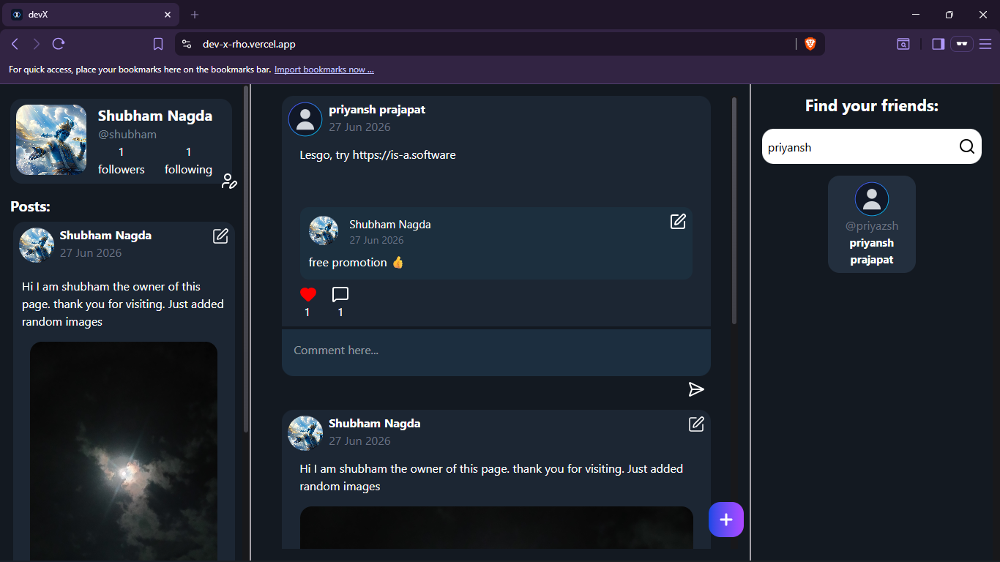
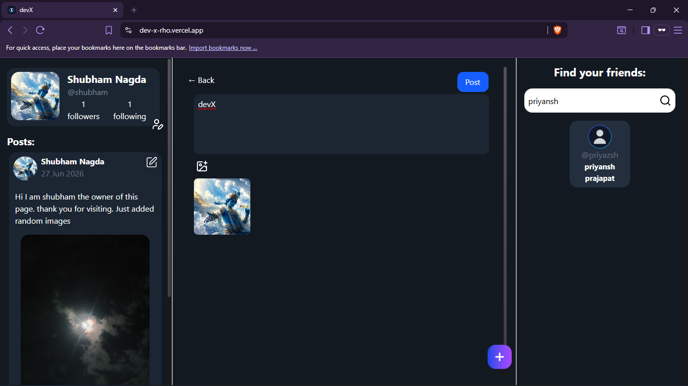

# DevX

<p align="center">
  <h3 align="center">A Full-Stack Social Platform for Developers</h3>

  <p align="center">
    Connect, share ideas, follow developers, and engage through posts, likes, and comments.
    <br />
    <br />
    <a href="https://dev-x-rho.vercel.app/"><strong>Live Demo »</strong></a>
    ·
    <a href="https://github.com/ShubhamNagda/devX"><strong>Repository</strong></a>
  </p>
</p>

---

## Table of Contents

- [About](#about)
- [Features](#features)
- [Tech Stack](#tech-stack)
- [Screenshots](#screenshots)
- [Project Structure](#project-structure)
- [Getting Started](#getting-started)
- [Environment Variables](#environment-variables)
- [Running the Project](#running-the-project)
- [API Overview](#api-overview)
- [Future Improvements](#future-improvements)
- [Contributing](#contributing)
- [Author](#author)
- [License](#license)

---

# About

DevX is a full-stack social networking platform built specifically for developers. It allows users to create accounts, share posts, upload images, follow other developers, and interact through likes and comments.

The application follows the MERN architecture and implements secure JWT authentication with refresh tokens. Images are stored using Cloudinary, while MongoDB serves as the primary database.

The project was built to gain hands-on experience with full-stack development, REST API design, authentication, state management, and modern React development.

---

# Features

### Authentication

- User Registration
- Secure Login
- JWT Authentication
- Refresh Tokens
- Protected Routes

### User Profile

- Create an account
- Edit profile
- Upload profile picture
- View followers & following

### Posts

- Create new posts
- Upload images
- Edit posts
- Delete posts
- View posts from other users

### Social Interaction

- Like posts
- Unlike posts
- Add comments
- Follow users
- Unfollow users

### Search

- Search developers by username
- View public profiles

### Media

- Image uploads using Cloudinary

---

# Tech Stack

## Frontend

- React 19
- Vite
- React Router DOM
- Tailwind CSS
- Axios
- Lucide React

## Backend

- Node.js
- Express.js
- MongoDB
- Mongoose
- JWT
- bcrypt
- Multer
- Cloudinary
- Cookie Parser
- CORS

---

# Screenshots

Create a folder named **screenshots** in the root directory and place your images inside it.

```
screenshots/
│
├── login.png
├── signup.png
├── home.png
├── search.png
└── create-post.png
```

## Login



---

## Register



---

## Home Feed



---

## Search Users



---

## Create Post



---

# Project Structure

```
devX
│
├── Backend
│   ├── src
│   │   ├── controllers
│   │   ├── middleware
│   │   ├── models
│   │   ├── routes
│   │   ├── utils
│   │   ├── db
│   │   └── app.js
│   │
│   ├── package.json
│   └── .env
│
├── Frontend
│   ├── src
│   ├── public
│   ├── package.json
│   └── .env
│
├── screenshots
│
└── README.md
```

---

# Getting Started

## Clone the repository

```bash
git clone https://github.com/ShubhamNagda/devX.git
```

Move into the project directory.

```bash
cd devX
```

---

## Install Backend Dependencies

```bash
cd Backend
npm install
```

---

## Install Frontend Dependencies

```bash
cd ../Frontend
npm install
```

---

# Environment Variables

## Backend (.env)

```env
PORT=

CORS_ORIGIN=

ACCESS_TOKEN_SECRET=
ACCESS_TOKEN_EXPIRY=

REFRESH_TOKEN_SECRET=
REFRESH_TOKEN_EXPIRY=

MONGODB_URI=

CLOUDINARY_CLOUD_NAME=
CLOUDINARY_API_KEY=
CLOUDINARY_API_SECRET=

NODE_ENV=(development/production)
```

---

## Frontend (.env)

```env
VITE_API_URL_USERS=
VITE_API_URL_FOLLOWS=
VITE_API_URL_POSTS=
VITE_API_URL_LIKES=
VITE_API_URL_COMMENTS=
```

---

# Running the Project

### Start Backend

```bash
cd Backend
npm run dev
```

---

### Start Frontend

```bash
cd Frontend
npm run dev
```

Open your browser and visit

```
http://localhost:5173
```

---

# API Overview

The backend exposes RESTful APIs for all major features.

### Authentication & Users

```
/api/v1/users
```

Handles:

- Register
- Login
- Logout
- Refresh Token
- User Profile
- Profile Update

---

### Posts

```
/api/v1/posts
```

Handles:

- Create Post
- Get Posts
- Edit Post
- Delete Post

---

### Likes

```
/api/v1/likes
```

Handles:

- Like
- Unlike

---

### Comments

```
/api/v1/comments
```

Handles:

- Add Comment
- Delete Comment

---

### Follow

```
/api/v1/follows
```

Handles:

- Follow User
- Unfollow User

---

# Architecture

```
React
   │
Axios
   │
Express API
   │
Controllers
   │
MongoDB
   │
Cloudinary
```

---

# Security

- Passwords are hashed using bcrypt.
- Authentication uses JWT Access Tokens and Refresh Tokens.
- Protected routes require authentication.
- HTTP-only cookies are used where applicable.
- Sensitive configuration is stored using environment variables.

---

# Future Improvements

- Real-time notifications
- Direct messaging
- Infinite scrolling
- Dark mode
- Email verification
- Password reset
- Bookmark posts
- User activity feed
- Responsive mobile improvements
- Real-time chat using Socket.IO

---

# Contributing

Contributions are welcome.

1. Fork the repository.

2. Create a new branch.

```bash
git checkout -b feature-name
```

3. Commit your changes.

```bash
git commit -m "Add feature"
```

4. Push to GitHub.

```bash
git push origin feature-name
```

5. Open a Pull Request.

---

# Live Demo

https://dev-x-rho.vercel.app/

---

# Repository

https://github.com/ShubhamNagda/devX

---

# Author

**Shubham Nagda**

GitHub:
https://github.com/ShubhamNagda

---

# License

This project is licensed under the MIT License.

Feel free to use, modify, and distribute this project under the terms of the MIT License.

---

## Acknowledgements

This project was built as a learning-focused full-stack application to strengthen practical knowledge of the MERN stack, RESTful APIs, authentication, database design, and modern frontend development.
